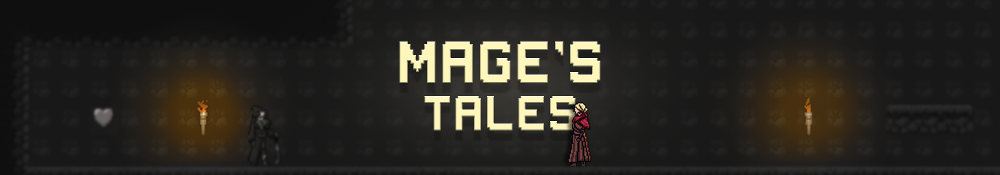
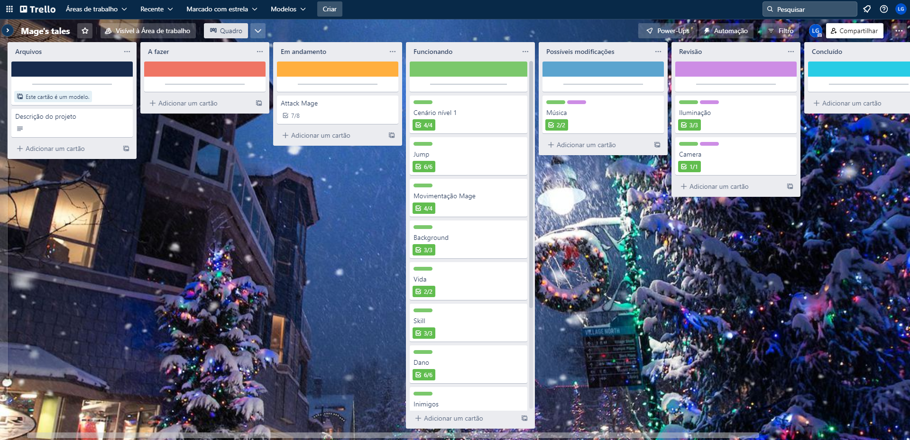

## Project Mage's tales

---
#### Hello there! :wave: Attention :cop: :warning:

This readme has two versions, english and portuguese, if you want to read in portuguese click [HERE](#versão-em-português) or [PORTUGUÊS](#versão-em-português).

## Objective :santa:
This project has the objective to learn and practice game development, Unity and C#, in addition to use it as part of my portfolio.

## Introduction :bell:
My idea with the Mage's Tales project was to take a lot of concepts I've been learning about game development, Unity and C#, and apply them to a single project. That way, I can learn more resources and be aware of which concepts I still need to evolve.

## Aplication :mage:
The Mage's Tales project is a mini RPG-style 2d platform game where the player uses magic to defeat enemies. In this project, I decided to use several different concepts, the first part of the map uses the concept of parallax background, a background that moves along with the player, in practice it is as if the background had been placed throughout the entire map, but in reality it was only placed in the initial part of the map.
Parallax background gif:

In the second part of the map, the player enters a cave, where I use the second different scenario concept, which is the lighting. By default, Unity already has its own lighting, but it is possible to add different types of lighting. As it is a cave, the intensity of global lighting has been reduced so that the environment remains darker, in addition, I have added several torches throughout the cave, all of which have a lighting called Spot light, a type of light that has a small range.
Cave entrance gif:

## Behind the project :christmas_tree:
During this project I used two tools to organize myself, github desktop and [trello](https://trello.com/b/iNxmQgsg/mages-tales), both tools I had already used in other projects. Before starting the project, it's important to understand what actually needs to be done, and for that I used [trello](https://trello.com/b/iNxmQgsg/mages-tales). Many developers use this tool to organize themselves, and I did the same, I set up several cards in my trello, showing in each one what I needed to do, separating them by topics, such as character creation, parallax background, lighting, and etc.

After that, I separated them by categories, if this part of the project was working, if it was in progress, or if I didn't start yet this part.
Print Trello: 

In addition, I've always been adding each update in my project to my github, using github desktop, an integration platform between git and github.

## Assets :snowflake:
- Background: [Eder Munizz](https://edermunizz.itch.io/free-pixel-art-forest) no Itch.io.
- Tileset and map details: [Cainos](https://assetstore.unity.com/packages/2d/environments/pixel-art-platformer-village-props-166114) in Unity asset store.
- Mages character: Download for [Craftpix](https://craftpix.net/freebies/free-wizard-sprite-sheets-pixel-art/?num=3&count=48&sq=mage%20light&pos=5).
- Character projectile explosion: Download for [Craftpix](https://craftpix.net/freebies/free-animated-explosion-sprite-pack/?num=1&count=46&sq=explosion&pos=5).
- Wolf: [Studio SoulAres](https://itch.io/queue/c/1277062/moonroar-asset-series?game_id=874102) in Itch.io.
- Background music: [Poligons sounds](https://assetstore.unity.com/packages/audio/music/casual-kingdom-world-sounds-free-136406) in Unity asset store.
- Collectible sound: Available by youtuber [Pandemonium](https://www.youtube.com/watch?v=7e6GJtm3FU4&t=864s).
- Readme banner: Made by [Cristiane Silva](https://www.linkedin.com/in/cristianescs/).

## Conclusion :snowman:

I learned a lot of things doing this project, things like the concepts applied to the parallax background and lighting, in addition to getting deeper and deeper into Unity and programming in C#.

If you only want to download the folder with the game's executable, I'm providing the link to my google drive in the "About" tab.

Thanks for reading, I wish you a good week, see ya. :wave:

---
## Versão em português
## Objetivo :santa:
Esse projeto tem como objetivo aprender e praticar desenvolvimento de jogos, Unity e C#, além de usá-lo como parte do meu portfólio.

## Introdução :bell:
A minha ideia com o projeto Mage's Tales foi de pegar vários conceitos que venho aprendendo sobre desenvolvimento de jogos, Unity e C#, e aplicá-los em um único projeto. Dessa forma, eu consigo aprender mais recursos e ter noção de quais conceitos eu ainda preciso evoluir.

## Aplicação :mage:
O projeto Mage's Tales é um mini jogo de plataforma 2d no estilo RPG, onde o jogador utiliza magia para derrotar os inimigos. Nesse projeto, eu resolvi utilizar vários conceitos diferentes, a primeira parte do mapa utiliza o conceito de parallax background, um plano de fundo que se movimenta junto com o jogador, na prática é como se o plano de fundo tivesse sido colocado pelo mapa inteiro, mas na realidade só foi colocado na parte inicial do mapa.
Gif do parallax background:

Na segunda parte do mapa o jogador entra em uma caverna, onde eu utilizei o segundo conceito diferente de cenário, que são as iluminações. Por padrão, a Unity já possui iluminação própria, porém é possível adicionar diferentes tipos de iluminação. Por ser uma caverna, a intensidade da iluminação global foi reduzida para que o ambiente ficasse mais escuro, além disso, adicionei diversas tochas pela caverna, todas elas possuem uma iluminação chamada de Spot light, um tipo de luz que tem um alcance pequeno.
Gif da entrada na caverna:

## Por trás do projeto :christmas_tree:
Durante esse projeto eu utilizei duas ferramentas para me organizar, o github desktop e o [trello](https://trello.com/b/iNxmQgsg/mages-tales), ambas as ferramentas eu já havia utilizado em outros projetos. Antes de começar o projeto é importante entender o que de fato é necessário fazer, e para isso eu utlizei o [trello](https://trello.com/b/iNxmQgsg/mages-tales). Muitos desenvolvedores utilizam essa ferramenta para se organizar, e eu fiz o mesmo, montei no meu trello diversos cartões, mostrando em cada um deles o que eu precisava fazer, separando por tópicos, como por exemplo a criação do personagem, o parallax background, iluminação, e etc.

Após isso, eu os separei por categorias, se esse tópico do projeto já estava funcionando, se estava em andamento, ou ainda era necessário fazer do zero.
Print Trello: 

Além disso, sempre fui adicionando no meu github cada atualização do projeto, utilizando o github desktop, plataforma de integração entre git e github.

## Assets :snowflake:
- Background: [Eder Munizz](https://edermunizz.itch.io/free-pixel-art-forest) no Itch.io.
- Tileset e detalhes do mapa: [Cainos](https://assetstore.unity.com/packages/2d/environments/pixel-art-platformer-village-props-166114) na Unity asset store.
- Personagens magos: Download pela [Craftpix](https://craftpix.net/freebies/free-wizard-sprite-sheets-pixel-art/?num=3&count=48&sq=mage%20light&pos=5).
- Explosão de projétil do personagem: Download pela [Craftpix](https://craftpix.net/freebies/free-animated-explosion-sprite-pack/?num=1&count=46&sq=explosion&pos=5).
- Lobo: [Studio SoulAres](https://itch.io/queue/c/1277062/moonroar-asset-series?game_id=874102) no Itch.io.
- Música de fundo: [Poligons sounds](https://assetstore.unity.com/packages/audio/music/casual-kingdom-world-sounds-free-136406) na Unity asset store.
- Som de coletável: Disponibilizado pelo youtuber [Pandemonium](https://www.youtube.com/watch?v=7e6GJtm3FU4&t=864s).
- Banner do readme: Feito pela [Cristiane Silva](https://www.linkedin.com/in/cristianescs/).

## Conclusão :snowman:

Consegui aprender muito fazendo esse projeto, principalmente nos conceitos aplicados no parallax background e na iluminação, além de me aprofundar cada vez mais na Unity e programação em C#.

Caso queira baixar apenas a pasta com o executável do jogo, eu estou disponibilizando o link para o meu google drive na aba "About".

Obrigado por ler até aqui, te desejo uma ótima semana, até mais. :wave: